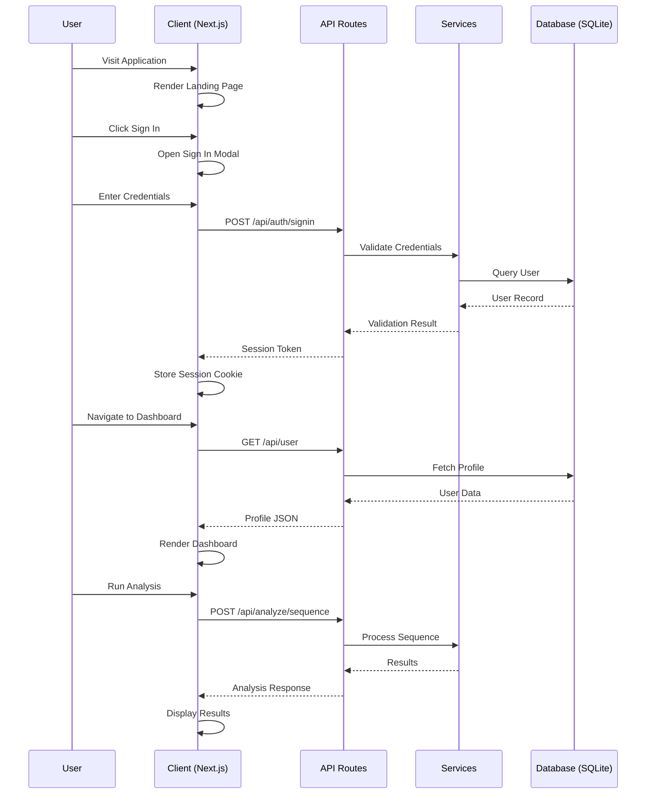
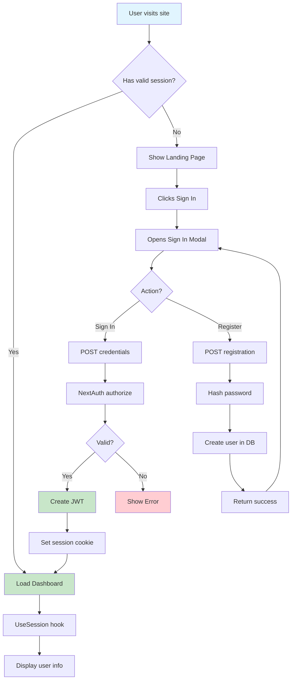

<div align="center">

# 📚 BioAlign Project Documentation

## *The Complete Developer Guide & Reference Manual*

**Version 1.0.0 | Last Updated: January 2025**

[🏠 Home](#table-of-contents) • [⚡ Quick Start](#quick-start) • [🏗️ Architecture](#architecture-overview) • [🔧 API Reference](#api-reference) • [📖 Guides](#development-guides)

</div>

---

## Table of Contents

1. [Introduction](#1-introduction)
2. [Quick Start](#2-quick-start)
3. [Architecture Overview](#3-architecture-overview)
4. [Project Structure](#4-project-structure)
5. [Authentication System](#5-authentication-system)
6. [Database Schema](#6-database-schema)
7. [API Reference](#7-api-reference)
8. [Component Library](#8-component-library)
9. [Sequence Analysis Utilities](#9-sequence-analysis-utilities)
10. [Tools Catalog System](#10-tools-catalog-system)
11. [UI/UX Design System](#11-uiux-design-system)
12. [Development Guides](#12-development-guides)
13. [Deployment Guide](#13-deployment-guide)
14. [Troubleshooting](#14-troubleshooting)
15. [Appendix](#15-appendix)

---

## 1. Introduction

### 1.1 What is BioAlign?

**BioAlign** is a next-generation bioinformatics platform that provides researchers with a unified interface for analyzing biological sequences, proteins, genomes, and more. Built with modern web technologies, it offers:

- **50+ Integrated Tools**: From BLAST search to CRISPR design
- **Real-time Analysis**: Cloud-powered sequence processing
- **Beautiful Interface**: Modern glassmorphism UI with dark mode
- **Secure Authentication**: Production-ready auth with NextAuth.js
- **Collaboration Features**: Team workspaces and sharing capabilities

### 1.2 Key Technologies

| Technology | Version | Purpose |
|------------|---------|---------|
| Next.js | 16.x | React framework (App Router) |
| TypeScript | 5.x | Type-safe JavaScript |
| Tailwind CSS | 4.x | Utility-first CSS framework |
| shadcn/ui | Latest | Component library |
| Prisma | 6.x | Database ORM |
| SQLite | 3.x | Local database |
| NextAuth.js | 4.x | Authentication |
| Framer Motion | 12.x | Animations |
| Recharts | 2.x | Data visualization |
| Zustand | 5.x | State management |

### 1.3 Target Audience

This documentation is intended for:
- ✅ Developers contributing to the codebase
- ✅ DevOps engineers deploying the platform
- ✅ Researchers customizing tools
- ✅ Anyone interested in understanding the architecture

---

## 2. Quick Start

### 2.1 Prerequisites

Ensure you have the following installed:

```bash
# Check Node.js version (>= 18.x)
node --version

# Or use Bun (recommended)
bun --version

# Check if Git is installed
git --version
```

### 2.2 Installation Steps

```bash
# 1. Clone the repository
git clone https://github.com/yourusername/bioalign.git
cd bioalign

# 2. Install dependencies
bun install

# 3. Set up environment variables
cp .env.example .env.local

# 4. Initialize database
bun run db:push

# 5. Seed demo user (optional)
curl -X POST http://localhost:3000/api/auth/seed

# 6. Start development server
bun run dev
```

### 2.3 Environment Variables

Create a `.env.local` file in the root directory:

```env
# ===========================================
# BioAlign Environment Configuration
# ===========================================

# Database Connection
DATABASE_URL="file:./dev.db"

# NextAuth Configuration (REQUIRED for production)
NEXTAUTH_SECRET="generate-a-random-secret-here"
NEXTAUTH_URL="http://localhost:3000"

# Optional: OAuth Providers
GOOGLE_CLIENT_ID=""
GOOGLE_CLIENT_SECRET=""
GITHUB_ID=""
GITHUB_SECRET=""

# Optional: AI SDK Configuration
ZAI_SDK_API_KEY=""
```

#### Generating NEXTAUTH_SECRET

```bash
# Using OpenSSL
openssl rand -base64 32

# Using Node.js
node -e "console.log(require('crypto').randomBytes(32).toString('base64'))"

# Using Bun
bun -e "console.log(crypto.randomUUID())"
```

### 2.4 Demo Credentials

After seeding the database, use these credentials to test:

| Field | Value |
|-------|-------|
| Email | `demo@bioalign.io` |
| Password | `demo1234` |
| Name | Demo Researcher |
| Role | user |

### 2.5 Available Scripts

```bash
# Development
bun run dev          # Start dev server on port 3000
bun run lint         # Run ESLint checks

# Database
bun run db:push      # Push schema to database
bun run db:generate  # Generate Prisma client
bun run db:migrate   # Run migrations
bun run db:reset     # Reset database

# Production
bun run build        # Build for production
bun run start        # Start production server
```

---

## 3. Architecture Overview

### 3.1 High-Level Architecture

```
┌─────────────────────────────────────────────────────────────────────┐
│                           CLIENT LAYER                              │
│  ┌─────────────────────────────────────────────────────────────┐    │
│  │                    Next.js App Router                        │    │
│  │  ┌──────────┐  ┌──────────┐  ┌──────────┐  ┌──────────┐    │    │
│  │  │ Landing  │  │Dashboard │  │  Tools   │  │ Settings │    │    │
│  │  │   Page   │  │ Layout   │  │ Catalog  │  │   Page   │    │    │
│  │  └──────────┘  └──────────┘  └──────────┘  └──────────┘    │    │
│  └─────────────────────────────────────────────────────────────┘    │
├─────────────────────────────────────────────────────────────────────┤
│                          API LAYER                                  │
│  ┌──────────────┐  ┌──────────────┐  ┌──────────────────────────┐  │
│  │ /api/auth/*  │  │ /api/analyze │  │       /api/user          │  │
│  │              │  │      /*       │  │                          │  │
│  │ - register   │  │ - sequence   │  │ - GET profile            │  │
│  │ - nextauth   │  │ - blast      │  │ - PUT update             │  │
│  │ - seed       │  │ - align      │  │                          │  │
│  └──────────────┘  └──────────────┘  └──────────────────────────┘  │
├─────────────────────────────────────────────────────────────────────┤
│                         SERVICE LAYER                               │
│  ┌──────────────┐  ┌──────────────┐  ┌──────────────────────────┐  │
│  │   Auth.ts    │  │ Sequence-   │  │     Prisma Client        │  │
│  │              │  │ utils.ts     │  │                          │  │
│  │ NextAuth     │  │ Bioinformatics│  │ - User CRUD             │  │
│  │ Config       │  │ Algorithms   │  │ - Account Mgmt           │  │
│  └──────────────┘  └──────────────┘  └──────────────────────────┘  │
├─────────────────────────────────────────────────────────────────────┤
│                         DATA LAYER                                  │
│                    ┌──────────────────────┐                         │
│                    │      SQLite DB        │                         │
│                    │  (via Prisma ORM)     │                         │
│                    └──────────────────────┘                         │
└─────────────────────────────────────────────────────────────────────┘
```

### 3.2 Application Flow



### 3.3 Key Design Decisions

| Decision | Rationale |
|----------|-----------|
| **App Router over Pages Router** | Better code splitting, layouts, server components |
| **JWT Sessions** | Stateless, scalable, works well with SQLite |
| **SQLite for Dev** | Zero configuration, file-based, easy backups |
| **shadcn/ui Components** | Customizable, no runtime dependency, accessible |
| **Zustand for State** | Simple API, TypeScript-friendly, minimal boilerplate |
| **Framer Motion** | Declarative animations, great performance |

---

## 4. Project Structure

### 4.1 Directory Tree

```
bioalign/
│
├── prisma/
│   ├── schema.prisma              # Database schema definition
│   └── dev.db                     # SQLite database file (auto-generated)
│
├── public/
│   ├── images/                    # Static images
│   └── icons/                     # App icons and favicons
│
├── src/
│   ├── app/                       # Next.js App Router
│   │   ├── api/                   # API route handlers
│   │   │   ├── auth/
│   │   │   │   ├── [...nextauth]/
│   │   │   │   │   └── route.ts   # NextAuth handler
│   │   │   │   ├── register/
│   │   │   │   │   └── route.ts   # Registration endpoint
│   │   │   │   └── seed/
│   │   │   │       └── route.ts   # Demo data seeder
│   │   │   ├── analyze/
│   │   │   │   └── sequence/
│   │   │   │       └── route.ts   # Sequence analysis API
│   │   │   ├── ai/
│   │   │   │   └── chat/
│   │   │   │       └── route.ts   # AI chat endpoint
│   │   │   └── user/
│   │   │       └── route.ts      # User profile API
│   │   ├── layout.tsx             # Root layout component
│   │   └── page.tsx               # Main page (Landing + Dashboard)
│   │
│   ├── components/
│   │   ├── landing/               # Landing page sections
│   │   │   ├── hero.tsx           # Hero section with DNA animation
│   │   │   ├── features.tsx       # Feature cards grid
│   │   │   ├── workflow.tsx       # Workflow steps
│   │   │   ├── tools-showcase.tsx # Tools preview
│   │   │   ├── statistics.tsx     # Stats counters
│   │   │   ├── testimonials.tsx   # User testimonials
│   │   │   ├── faq.tsx            # FAQ accordion
│   │   │   ├── tutorials.tsx      # Tutorial cards
│   │   │   ├── documentation.tsx  # Documentation links
│   │   │   ├── partners.tsx       # Partner logos
│   │   │   ├── about-creator.tsx  # About section
│   │   │   ├── support-coffee.tsx # Support section
│   │   │   ├── navbar.tsx         # Navigation bar
│   │   │   └── footer.tsx         # Footer component
│   │   │
│   │   ├── dashboard/             # Dashboard components
│   │   │   ├── dashboard-layout.tsx # Main dashboard wrapper
│   │   │   ├── sidebar.tsx        # Sidebar navigation
│   │   │   ├── tools-catalog.tsx  # Tools browser
│   │   │   ├── file-upload.tsx    # File upload component
│   │   │   ├── settings.tsx       # Settings panel
│   │   │   └── ai-assistant.tsx   # AI chat panel
│   │   │
│   │   ├── auth/                  # Authentication components
│   │   │   ├── session-provider.tsx # Session context provider
│   │   │   └── sign-in-modal.tsx  # Login/Register modal
│   │   │
│   │   ├── tools/                 # Analysis tool components
│   │   │   └── sequence-analysis.tsx # Sequence analyzer UI
│   │   │
│   │   └── ui/                    # shadcn/ui base components (40+)
│   │       ├── button.tsx
│   │       ├── card.tsx
│   │       ├── dialog.tsx
│   │       ├── input.tsx
│   │       ├── ... (40+ components)
│   │
│   ├── hooks/                     # Custom React hooks
│   │   ├── use-user.ts            # User profile hook
│   │   ├── use-ai-chat.ts         # AI chat hook
│   │   ├── use-mobile.ts          # Mobile detection hook
│   │   └── use-toast.ts           # Toast notification hook
│   │
│   ├── lib/                       # Core libraries
│   │   ├── auth.ts                # NextAuth configuration
│   │   ├── db.ts                  # Prisma client singleton
│   │   ├── utils.ts               # Utility functions (cn, etc.)
│   │   ├── file-types.ts          # File type definitions
│   │   ├── sequence-utils.ts      # Bioinformatics algorithms
│   │   └── tools-data.ts          # Tools catalog data
│   │
│   └── types/                     # TypeScript type definitions
│
├── mini-services/                 # Microservices
│   └── websocket/                 # WebSocket service
│       └── index.ts
│
├── examples/                      # Example implementations
│   └── websocket/                 # WebSocket examples
│
├── .env.example                   # Environment template
├── .eslintrc.json                 # ESLint configuration
├── components.json                # shadcn/ui config
├── next.config.ts                 # Next.js configuration
├── tailwind.config.ts             # Tailwind CSS config
├── tsconfig.json                  # TypeScript config
├── package.json                   # Dependencies & scripts
└── README.md                      # Project README
```

### 4.2 Key Files Explained

| File | Purpose | Importance |
|------|---------|------------|
| `src/app/page.tsx` | Main entry point, handles routing between landing/dashboard | ⭐⭐⭐⭐⭐ |
| `src/lib/auth.ts` | NextAuth configuration, JWT strategy setup | ⭐⭐⭐⭐⭐ |
| `src/lib/db.ts` | Prisma client singleton for database access | ⭐⭐⭐⭐⭐ |
| `src/lib/sequence-utils.ts` | Core bioinformatics algorithms | ⭐⭐⭐⭐⭐ |
| `prisma/schema.prisma` | Database schema definition | ⭐⭐⭐⭐⭐ |
| `src/components/dashboard/dashboard-layout.tsx` | Dashboard shell with sidebar/header | ⭐⭐⭐⭐ |
| `src/hooks/use-user.ts` | User session/profile management hook | ⭐⭐⭐⭐ |

---

## 5. Authentication System

### 5.1 Overview

BioAlign uses **NextAuth.js v4** with the **JWT strategy** for stateless authentication. This approach is ideal for:

- Scalable applications (no server-side sessions)
- SQLite databases (no session table needed)
- Multi-instance deployments

### 5.2 Authentication Flow



### 5.3 Configuration (`src/lib/auth.ts`)

```typescript
import type { NextAuthOptions } from "next-auth"
import CredentialsProvider from "next-auth/providers/credentials"
import { compare } from "bcryptjs"
import { db } from "@/lib/db"

export const authOptions: NextAuthOptions = {
  // Use JWT strategy (stateless)
  session: {
    strategy: "jwt",
    maxAge: 30 * 24 * 60 * 60, // 30 days
  },
  
  // Custom pages (redirect to home instead of default pages)
  pages: {
    signIn: "/",
    error: "/",
  },
  
  providers: [
    CredentialsProvider({
      name: "credentials",
      credentials: {
        email: { label: "Email", type: "email" },
        password: { label: "Password", type: "password" },
      },
      async authorize(credentials) {
        // 1. Validate input
        if (!credentials?.email || !credentials?.password) {
          throw new Error("Email and password are required")
        }

        // 2. Find user by email
        const user = await db.user.findUnique({
          where: { email: credentials.email },
        })

        if (!user || !user.password) {
          throw new Error("Invalid email or password")
        }

        // 3. Verify password using bcrypt
        const isValid = await compare(credentials.password, user.password)

        if (!isValid) {
          throw new Error("Invalid email or password")
        }

        // 4. Return user object (stored in JWT)
        return {
          id: user.id,
          name: user.name,
          email: user.email,
          image: user.image,
          role: user.role,
        }
      },
    }),
  ],
  
  callbacks: {
    // Add custom fields to JWT token
    async jwt({ token, user }) {
      if (user) {
        token.id = user.id
        token.role = (user as any).role
      }
      return token
    },
    
    // Add custom fields to session
    async session({ session, token }) {
      if (token) {
        session.user.id = token.id as string
        session.user.role = token.role as string
      }
      return session
    },
  },
  
  secret: process.env.NEXTAUTH_SECRET || "bioalign-secret-key-change-in-production",
}
```

### 5.4 Registration API (`/api/auth/register`)

**Endpoint**: `POST /api/auth/register`

**Request Body**:
```json
{
  "name": "John Doe",
  "email": "john@example.com",
  "password": "securepassword123",
  "institution": "Stanford University"
}
```

**Response (201 Created)**:
```json
{
  "success": true,
  "message": "Account created successfully",
  "user": {
    "id": "clxxxxxxx",
    "name": "John Doe",
    "email": "john@example.com"
  }
}
```

**Error Responses**:
| Status | Condition | Message |
|--------|-----------|--------|
| 400 | Missing fields | "Email and password are required" |
| 400 | Short password | "Password must be at least 8 characters" |
| 409 | Email exists | "An account with this email already exists" |
| 500 | Server error | "An error occurred during registration" |

### 5.5 Using Authentication in Components

#### Session Provider Setup

```tsx
// app/layout.tsx or app/page.tsx
import { SessionProvider } from "@/components/auth/session-provider"

export default function RootLayout({ children }: { children: React.ReactNode }) {
  return (
    <SessionProvider>
      {children}
    </SessionProvider>
  )
}
```

#### Accessing Session Data

```tsx
// Using useSession hook
"use client"
import { useSession } from "next-auth/react"

function UserProfile() {
  const { data: session, status } = useSession()
  
  if (status === "loading") {
    return <div>Loading...</div>
  }
  
  if (!session) {
    return <div>Please sign in</div>
  }
  
  return (
    <div>
      <p>Name: {session.user?.name}</p>
      <p>Email: {session.user?.email}</p>
      <p>Role: {session.user?.role}</p>
    </div>
  )
}
```

#### Using Custom useUser Hook

```tsx
// Enhanced user hook with profile data
"use client"
import { useUser } from "@/hooks/use-user"

function UserCard() {
  const {
    isAuthenticated,
    userDisplayName,
    userEmail,
    userInitials,
    userRole,
    userProfile,
    refreshUser,
    updateUser,
  } = useUser()
  
  if (!isAuthenticated) {
    return null
  }
  
  return (
    <div className="p-4 border rounded-lg">
      <Avatar>{userInitials}</Avatar>
      <h2>{userDisplayName}</h2>
      <p>{userEmail}</p>
      <Badge>{userRole}</Badge>
      
      {userProfile && (
        <p>Member since: {userProfile.memberSince}</p>
      )}
      
      <button onClick={refreshUser}>Refresh</button>
      <button onClick={() => updateUser({ name: "New Name" })}>
        Update Name
      </button>
    </div>
  )
}
```

### 5.6 Signing Out

```tsx
import { signOut } from "next-auth/react"

function SignOutButton() {
  return (
    <button onClick={() => signOut({ callbackUrl: "/" })}>
      Sign Out
    </button>
  )
}
```

---

## 6. Database Schema

### 6.1 Entity Relationship Diagram

```mermaid
erDiagram
    USER ||--o{ ACCOUNT : has
    USER ||--o{ POST : writes
    ACCOUNT {
        string id PK
        string userId FK
        string type
        string provider
        string providerAccountId UK
        string refresh_token
        string access_token
        int expires_at
        string token_type
        string scope
        string id_token
        string session_state
    }
    USER {
        string id PK
        string name
        string email UK
        datetime emailVerified
        string password
        string image
        string role
        string institution
        datetime createdAt
        datetime updatedAt
    }
    POST {
        string id PK
        string title
        string content
        boolean published
        string authorId FK
        datetime createdAt
        datetime updatedAt
    }
    VERIFICATION_TOKEN {
        string identifier PK
        string token PK UK
        datetime expires
    }
```

### 6.2 Schema Definition (`prisma/schema.prisma`)

```prisma
// This is your Prisma schema file
generator client {
  provider = "prisma-client-js"
}

datasource db {
  provider = "sqlite"
  url      = env("DATABASE_URL")
}

model User {
  id            String    @id @default(cuid())
  name          String?
  email         String    @unique
  emailVerified DateTime?
  password      String?
  image         String?
  role          String    @default("user")
  institution   String?
  createdAt     DateTime  @default(now())
  updatedAt     DateTime  @updatedAt
  
  // Relations
  accounts      Account[]
  posts         Post[]
}

model Account {
  id                String  @id @default(cuid())
  userId            String
  type              String
  provider          String
  providerAccountId String
  refresh_token     String?
  access_token      String?
  expires_at        Int?
  token_type        String?
  scope             String?
  id_token          String?
  session_state     String?

  user User @relation(fields: [userId], references: [id], onDelete: Cascade)

  @@unique([provider, providerAccountId])
}

model VerificationToken {
  identifier String
  token      String   @unique
  expires    DateTime

  @@unique([identifier, token])
}

model Post {
  id        String   @id @default(cuid())
  title     String
  content   String?
  published Boolean  @default(false)
  authorId  String
  createdAt DateTime @default(now())
  updatedAt DateTime @updatedAt

  author User @relation(fields: [authorId], references: [id], onDelete: Cascade)
}
```

### 6.3 Database Operations

#### Prisma Client Singleton (`src/lib/db.ts`)

```typescript
import { PrismaClient } from '@prisma/client'

const globalForPrisma = globalThis as unknown as {
  prisma: PrismaClient | undefined
}

export const db =
  globalForPrisma.prisma ??
  new PrismaClient({
    log: ['query'], // Log queries in development
  })

if (process.env.NODE_ENV !== 'production') globalForPrisma.prisma = db
```

#### Common CRUD Operations

```typescript
import { db } from '@/lib/db'

// CREATE - New User
const newUser = await db.user.create({
  data: {
    name: 'John Doe',
    email: 'john@example.com',
    password: '$2a$12$hashedpassword',
    institution: 'MIT',
  },
})

// READ - Get User by ID
const user = await db.user.findUnique({
  where: { id: 'user-id-here' },
  select: {
    id: true,
    name: true,
    email: true,
    role: true,
    createdAt: true,
  },
})

// READ - Get User by Email
const userByEmail = await db.user.findUnique({
  where: { email: 'john@example.com' },
})

// UPDATE - Update User Profile
const updated = await db.user.update({
  where: { id: 'user-id' },
  data: {
    name: 'New Name',
    institution: 'New Institution',
  },
})

// DELETE - Soft Delete (if implemented)
// Or hard delete:
await db.user.delete({
  where: { id: 'user-id' },
})

// LIST - With Pagination
const users = await db.user.findMany({
  skip: 0,
  take: 10,
  orderBy: { createdAt: 'desc' },
})
```

### 6.4 Database Commands

```bash
# Push schema changes to database (destructive in dev)
bun run db:push

# Generate Prisma Client after schema changes
bun run db:generate

# Create a new migration
bun run db:migrate --name migration_name

# Reset database (WARNING: destroys all data!)
bun run db:reset

# Open Prisma Studio (visual database viewer)
npx prisma studio
```

---

## 7. API Reference

### 7.1 Authentication APIs

#### POST `/api/auth/register`

Create a new user account.

**Headers**:
```
Content-Type: application/json
```

**Request Body**:
| Field | Type | Required | Description |
|-------|------|----------|-------------|
| name | string | No | User's display name |
| email | string | Yes | Unique email address |
| password | string | Yes | Minimum 8 characters |
| institution | string | No | Affiliated institution |

**Success Response (201)**:
```json
{
  "success": true,
  "message": "Account created successfully",
  "user": {
    "id": "clabc123...",
    "name": "John Doe",
    "email": "john@example.com"
  }
}
```

**Error Responses**:
- `400 Bad Request`: Missing required fields or invalid input
- `409 Conflict`: Email already registered
- `500 Internal Server Error`: Database error

---

#### POST `/api/auth/seed`

Seed the database with a demo user for testing.

**Response (200)**:
```json
{
  "success": true,
  "message": "Demo user created",
  "credentials": {
    "email": "demo@bioalign.io",
    "password": "demo1234"
  }
}
```

---

### 7.2 Sequence Analysis API

#### POST `/api/analyze/sequence`

Perform various sequence analysis operations.

**Headers**:
```
Content-Type: application/json
```

**Request Body**:
| Field | Type | Required | Description |
|-------|------|----------|-------------|
| tool | string | Yes | Analysis tool to use |
| sequence | string | Yes | Input sequence string |
| options | object | No | Tool-specific options |

**Available Tools**:

| Tool ID | Description | Options |
|---------|-------------|---------|
| `gc-content` | Calculate GC percentage | - |
| `reverse-complement` | Generate reverse complement | - |
| `translate` | Translate to protein | `{ readingFrame: 1-6 }` |
| `orf-finder` | Find open reading frames | `{ minLength: number }` |
| `motif-search` | Search for patterns | `{ motif: string }` |
| `stats` | Full sequence statistics | - |

**Example Request**:
```json
{
  "tool": "gc-content",
  "sequence": "ATGCGATCGATCGTACGATCGATCGTAGCTAGCTAGCTAGCATGCATGCATGCATGCGATCGATCGATCGATCGATCGATCGATCG"
}
```

**Example Response**:
```json
{
  "success": true,
  "tool": "gc-content",
  "inputLength": 100,
  "timestamp": "2025-01-15T10:30:00.000Z",
  "type": "gc-content",
  "data": {
    "gcContent": 54.0,
    "atContent": 46.0,
    "gcCount": 54,
    "atCount": 46,
    "totalBases": 100,
    "composition": {
      "A": 23,
      "T": 23,
      "G": 27,
      "C": 27,
      "N": 0
    }
  }
}
```

---

### 7.3 User Profile API

#### GET `/api/user`

Get the current authenticated user's profile.

**Authentication**: Requires valid session

**Response (200)**:
```json
{
  "user": {
    "id": "clabc123...",
    "name": "Demo Researcher",
    "email": "demo@bioalign.io",
    "image": null,
    "role": "user",
    "institution": "BioAlign Labs",
    "emailVerified": "2025-01-01T00:00:00.000Z",
    "createdAt": "2025-01-01T00:00:00.000Z",
    "updatedAt": "2025-01-15T10:00:00.000Z",
    "memberSince": "January 2025",
    "accountAge": 14
  }
}
```

---

#### PUT `/api/user`

Update the current user's profile.

**Authentication**: Requires valid session

**Request Body**:
| Field | Type | Description |
|-------|------|-------------|
| name | string | New display name |
| image | string | Avatar URL |
| institution | string | Affiliated institution |

**Response (200)**:
```json
{
  "success": true,
  "message": "Profile updated successfully"
}
```

---

### 7.4 AI Chat API

#### POST `/api/ai/chat`

Send a message to the AI assistant.

**Request Body**:
| Field | Type | Required | Description |
|-------|------|----------|-------------|
| message | string | Yes | User's message |
| history | Array | No | Conversation history |

**Response (200)**:
```json
{
  "response": "Based on your sequence analysis...",
  "suggestions": [
    "Run BLAST search",
    "Check GC content"
  ]
}
```

---

## 8. Component Library

### 8.1 shadcn/ui Components

BioAlign uses **shadcn/ui** for its component library. These are copy-paste components (not npm dependencies) located in `src/components/ui/`.

#### Available Components (40+)

| Component | File | Usage |
|-----------|------|-------|
| Button | `button.tsx` | Primary actions, CTAs |
| Card | `card.tsx` | Content containers |
| Dialog | `dialog.tsx` | Modals, confirmations |
| Input | `input.tsx` | Text input fields |
| Label | `label.tsx` | Form labels |
| Select | `select.tsx` | Dropdown selections |
| Tabs | `tabs.tsx` | Tabbed navigation |
| Table | `table.tsx` | Data tables |
| Badge | `badge.tsx` | Status indicators |
| Avatar | `avatar.tsx` | User avatars |
| DropdownMenu | `dropdown-menu.tsx` | Context menus |
| Sheet | `sheet.tsx` | Slide-out panels |
| Toast/Sonner | `sonner.tsx` | Notifications |
| Tooltip | `tooltip.tsx` | Hover tooltips |
| ScrollArea | `scroll-area.tsx` | Custom scrollbars |
| Separator | `separator.tsx` | Visual dividers |
| Skeleton | `skeleton.tsx` | Loading placeholders |
| Progress | `progress.tsx` | Progress bars |
| Accordion | `accordion.tsx` | Expandable sections |
| Command | `command.tsx` | Command palette |
| Calendar | `calendar.tsx` | Date pickers |
| Form | `form.tsx` | Form handling |
| Chart | `chart.tsx` | Data visualizations |
| ... | ... | ... |

### 8.2 Custom Components

#### Dashboard Layout (`dashboard-layout.tsx`)

The main shell for the dashboard view.

```tsx
interface DashboardLayoutProps {
  children: React.ReactNode
  title?: string
  subtitle?: string
  actions?: React.ReactNode
  breadcrumbs?: Array<{
    label: string
    href?: string
    onClick?: () => void
  }>
}

// Usage
<DashboardLayout
  title="Sequence Analysis"
  subtitle="Analyze DNA, RNA, and protein sequences"
  actions={<Button>Export</Button>}
  breadcrumbs={[
    { label: 'Home', href: '#' },
    { label: 'Tools', href: '#' },
    { label: 'Sequence Analysis' }
  ]}
>
  {/* Tool content */}
</DashboardLayout>
```

**Features**:
- Responsive sidebar navigation
- Top header with search, notifications, user menu
- Breadcrumb navigation
- Dark mode toggle
- Mobile-responsive design

#### Sidebar Navigation (`sidebar.tsx`)

Configurable sidebar with navigation items.

```tsx
// Available navigation items
const navItems = [
  { icon: LayoutDashboard, label: 'Dashboard', href: '#dashboard' },
  { icon: Wrench, label: 'Tools', href: '#tools' },
  { icon: FlaskConical, label: 'Analysis', href: '#analysis' },
  { icon: FolderOpen, label: 'Projects', href: '#projects' },
  { icon: Users, label: 'Team', href: '#team' },
  { icon: Settings, label: 'Settings', href: '#settings' },
]
```

#### Landing Page Sections

| Section | Component | Description |
|---------|-----------|-------------|
| Hero | `hero.tsx` | Main banner with DNA animation, stats |
| Features | `features.tsx` | 12 feature cards in grid |
| Workflow | `workflow.tsx` | 5-step research pipeline |
| Tools Showcase | `tools-showcase.tsx` | Tool catalog preview |
| Statistics | `statistics.tsx` | Platform metrics |
| Testimonials | `testimonials.tsx` | User reviews |
| FAQ | `faq.tsx` | Common questions |
| Tutorials | `tutorials.tsx` | Learning resources |
| Navbar | `navbar.tsx` | Top navigation bar |
| Footer | `footer.tsx` | Site footer with links |

### 8.3 Component Patterns

#### Pattern 1: Animated Section Wrapper

```tsx
'use client'
import { motion } from 'framer-motion'

function AnimatedSection({ children, className }: Props) {
  return (
    <motion.section
      initial={{ opacity: 0, y: 20 }}
      whileInView={{ opacity: 1, y: 0 }}
      viewport={{ once: true }}
      transition={{ duration: 0.6 }}
      className={className}
    >
      {children}
    </motion.section>
  )
}
```

#### Pattern 2: Glassmorphism Card

```tsx
<div className="relative p-6 rounded-2xl 
  bg-white/70 dark:bg-gray-900/50 
  backdrop-blur-xl 
  border border-border/50 
  shadow-sm hover:shadow-xl 
  transition-all duration-300">
  {/* Content */}
</div>
```

#### Pattern 3: Gradient Text

```tsx
<h1 className="bg-gradient-to-r from-[#C1121F] via-red-600 to-orange-600 
  bg-clip-text text-transparent">
  Gradient Text
</h1>
```

---

## 9. Sequence Analysis Utilities

### 9.1 Overview

The sequence analysis utilities (`src/lib/sequence-utils.ts`) provide core bioinformatics algorithms for:

- Sequence validation and cleaning
- Type detection (DNA, RNA, Protein)
- GC content calculation
- Reverse complement generation
- Translation (DNA/RNA → Protein)
- ORF finding
- Pairwise alignment (global/local)
- BLAST-like searching
- Restriction enzyme mapping
- Motif/pattern searching
- FASTA parsing/formatting

### 9.2 Available Functions

#### Sequence Cleaning & Detection

```typescript
import {
  cleanSequence,
  detectSequenceType,
  validateSequence,
} from '@/lib/sequence-utils'

// Clean sequence (uppercase, remove non-letter chars)
cleanSequence('  atgCgAtcg  ') // Returns: 'ATGCGATCG'

// Detect sequence type
detectSequenceType('ATGCGATCG')  // Returns: 'DNA'
detectSequenceType('AUGCGAUCG')  // Returns: 'RNA'
detectSequenceType('MAGIVALLPL')  // Returns: 'Protein'

// Validate sequence
validateSequence('ATGCG')
// Returns: { valid: true, errors: [] }

validateSequence('ABC123')
// Returns: { valid: false, errors: ['Invalid character(s): 1, 2, 3'] }
```

#### Composition Analysis

```typescript
import {
  calculateGCContent,
  getComposition,
  getSequenceStats,
} from '@/lib/sequence-utils'

// Calculate GC percentage
calculateGCContent('ATGCGATCG') // Returns: 50

// Get nucleotide/amino acid counts
getComposition('ATGCGATCG')
// Returns: { A: 2, T: 2, G: 3, C: 3 }

// Complete statistics
getSequenceStats('ATGCGATCG')
// Returns: {
//   length: 9,
//   type: 'DNA',
//   gcContent: 55.56,
//   composition: { A: 2, T: 2, G: 3, C: 3 }
// }
```

#### Transformation Functions

```typescript
import {
  reverseComplement,
  translate,
} from '@/lib/sequence-utils'

// Reverse complement
reverseComplement('ATGCG') // Returns: 'CGCAT'

// Translation (6 frames supported)
translate('ATGCGATCG', 1)   // Frame 1:  'MR*'
translate('ATGCGATCG', 2)   // Frame 2:  '*AI*
translate('ATGCGATCG', -1)  // Frame -1 (reverse complement)
translate('ATGCGATCG', 1, 2) // Using mitochondrial genetic code
```

#### ORF Finding

```typescript
import { findORFs } from '@/lib/sequence-utils'

// Find all open reading frames
findORFs('ATG' + 'A'.repeat(300) + 'TAA')
// Returns: [{
//   start: 0,
//   end: 306,
//   frame: 1,
//   sequence: '...',
//   protein: 'M...',
//   length: 306
// }]

// Options
findORFs(sequence, {
  minLength: 100,      // Minimum ORF length (default: 30)
  geneticCode: 1,      // Genetic code table (default: 1)
  allFrames: true,     // Search all 6 frames (default: true)
  startCodons: ['ATG'] // Alternative start codons
})
```

#### Alignment Functions

```typescript
import {
  globalAlignment,
  localAlignment,
} from '@/lib/sequence-utils'

// Global alignment (Needleman-Wunsch)
globalAlignment('ATGCG', 'ATGGG', {
  matchScore: 1,
  mismatchPenalty: -1,
  gapPenalty: -1
})
// Returns: {
//   alignedSeq1: 'ATGCG-',
//   alignedSeq2: 'AT-GGG',
//   score: 2,
//   identity: 80,
//   similarity: 80,
//   gaps: 1,
//   midpoint: '|||. .'
// }

// Local alignment (Smith-Waterman)
localAlignment(seq1, seq2, options)
```

#### BLAST Search (Mock)

```typescript
import { mockBLASTSearch } from '@/lib/sequence-utils'

mockBLASTSearch('ATGCGATCGATCG', {
  database: 'nr',        // Target database
  maxTargets: 10,        // Maximum hits
  program: 'blastn'      // Program type
})
// Returns: {
//   queryId: 'Query',
//   queryLength: 13,
//   database: 'nr',
//   hits: [...],
//   statistics: {...}
// }
```

#### Restriction Enzyme Mapping

```typescript
import { findRestrictionSites, RESTRICTION_ENZYMES } from '@/lib/sequence-utils'

// Find all restriction sites
findRestrictionSites('GAATTCCGGATCC')

// Returns: [{
//   enzyme: 'EcoRI',
//   recognitionSite: 'GAATTC',
//   position: 0,
//   cutPosition: 1,
//   strand: '+'
// }, {
//   enzyme: 'BamHI',
//   recognitionSite: 'GGATCC',
//   position: 7,
//   cutPosition: 8,
//   strand: '+'
// }]

// Available enzymes
RESTRICTION_ENZYMES
// EcoRI, BamHI, HindIII, XbaI, SalI, KpnI, PstI, NotI, SacI, SmaI
```

#### Motif Searching

```typescript
import { searchMotif } from '@/lib/sequence-utils'

searchMotif('ATGCGATCGATCG', 'GATCG')
// Returns: [{
//   pattern: 'GATCG',
//   position: 3,
//   match: 'GATCG',
//   strand: '+'
// }, ...]

// With mismatch tolerance
searchMotif(sequence, 'GATCG', {
  allowMismatch: true,
  maxMismatches: 1
})
```

#### FASTA Parsing

```typescript
import { parseFASTA, formatFASTA } from '@/lib/sequence-utils'

// Parse FASTA format
parseFASTA(`>seq1 Example sequence
ATGCGATCG
>seq2 Another sequence
GCTAGCTA`)
// Returns: [
//   { name: 'seq1', sequence: 'ATGCGATCG' },
//   { name: 'seq2', sequence: 'GCTAGCTA' }
// ]

// Format as FASTA
formatFASTA('my_sequence', 'ATGCGATCGATCG', 60)
// Returns multi-line FASTA string
```

### 9.3 Genetic Code Tables

The library includes multiple genetic code translation tables:

| Code | Name | Notes |
|------|------|-------|
| 1 | Standard Nuclear | Default, most organisms |
| 2 | Vertebrate Mitochondrial | Different stop codons |

Access via `GENETIC_CODES[code]`.

### 9.4 Substitution Matrices

Pre-configured scoring matrices for alignments:

```typescript
SUBSTITUTION_MATRICES.BLOSUM62  // Default for proteins
SUBSTITUTION_MATRICES.BLOSUM50  // More divergent sequences
SUBSTITUTION_MATRICES.PAM250    // Distant homologs
SUBSTITUTION_MATRICES.PAM70     // Close homologs
```

---

## 10. Tools Catalog System

### 10.1 Data Structure

Tools are defined in `src/lib/tools-data.ts` with a structured format:

```typescript
interface BioTool {
  id: string;           // Unique identifier
  name: string;         // Display name
  description: string;  // Short description
  category: string;     // Category ID
  icon: string;         // Lucide icon name
  status: ToolStatus;   // available | beta | deprecated | maintenance
  popularity: number;   // 0-100 score
  tags: string[];       // Search tags
  version: string;      // Semantic version
  lastUpdated: string;  // ISO date
}

interface ToolCategory {
  id: string;
  name: string;
  description: string;
  icon: string;
  color: string;        // Hex color
  count: number;        // Number of tools
}
```

### 10.2 Available Categories

| Category ID | Name | Color | Count |
|-------------|------|-------|-------|
| sequence | Sequence Analysis | #10B981 | 15 |
| alignment | Sequence Alignment | #3B82F6 | 8 |
| structure | Structure Prediction | #8B5CF6 | 10 |
| genomics | Genomics | #F59E0B | 12 |
| transcriptomics | Transcriptomics | #EC4899 | 9 |
| phylogenetics | Phylogenetics | #059669 | 7 |
| docking | Molecular Docking | #6366F1 | 6 |
| crispr | CRISPR Tools | #EF4444 | 5 |
| primer | Primer Design | #14B8A6 | 8 |
| utilities | Utilities | #6B7280 | 14 |

### 10.3 Exported Functions

```typescript
import {
  getAllTools,
  searchTools,
  recentlyUsedTools,
  popularTools,
  getToolsByCategory,
  getToolById,
  toolCategories,
} from '@/lib/tools-data'

// Get all tools
getAllTools() // Returns: BioTool[]

// Search by query
searchTools('blast') // Returns matching tools

// Popular tools sorted by popularity
popularTools() // Returns: BioTool[] (sorted)

// Filter by category
getToolsByCategory('sequence') // Returns: Sequence analysis tools

// Get single tool
getToolById('blast') // Returns: BioTool | undefined
```

### 10.4 Adding a New Tool

To add a new tool to the catalog:

1. Add to `allTools` array in `tools-data.ts`:

```typescript
{
  id: 'my-new-tool',
  name: 'My New Tool',
  description: 'What this tool does',
  category: 'sequence',  // Existing category
  icon: 'Zap',          // Lucide icon name
  status: 'available',
  popularity: 75,
  tags: ['analysis', 'new'],
  version: '1.0.0',
  lastUpdated: '2025-01-15',
}
```

2. Create the tool component in `src/components/tools/`
3. Add API endpoint in `src/app/api/analyze/`
4. Register in tools catalog if needed

---

## 11. UI/UX Design System

### 11.1 Color Palette

| Name | Hex | Tailwind Class | Usage |
|------|-----|----------------|-------|
| Primary Red | `#C1121F` | `text-[#C1121F]` | Brand, CTAs, accents |
| Dark Red | `#9B1B30` | `text-[#9B1B30]` | Gradients, hover states |
| Accent Red | `#A41623` | `text-[#A41623]` | Secondary elements |
| Light Background | `#FAFAFA` | `bg-[#FAFAFA]` | Light mode background |
| Dark Background | `#0A0A0A` | `bg-black` | Dark mode background |

### 11.2 Typography Scale

| Element | Size | Weight | Class |
|---------|------|--------|-------|
| H1 Hero | 4xl-8xl | Bold | `text-4xl sm:text-5xl md:text-6xl lg:text-7xl xl:text-8xl font-bold` |
| H2 Section | 3xl-5xl | Bold | `text-3xl sm:text-4xl lg:text-5xl font-bold` |
| H3 Card | xl-2xl | Semibold | `text-xl font-semibold` |
| Body Large | lg-xl | Normal | `text-lg` |
| Body Base | base | Normal | `text-base` |
| Small/Caption | sm-xs | Medium | `text-sm text-muted-foreground` |

### 11.3 Spacing System

Uses Tailwind's default spacing scale (4px base):

| Token | Value | Usage |
|-------|-------|-------|
| `gap-2` | 8px | Tight spacing |
| `gap-4` | 16px | Default spacing |
| `gap-6` | 24px | Section padding |
| `gap-8` | 32px | Large sections |
| `gap-12` | 48px | Major sections |
| `gap-16` | 64px | Page sections |
| `gap-24` | 96px | Hero sections |

### 11.4 Border Radius

| Size | Value | Class | Usage |
|------|-------|-------|-------|
| Small | 4px | `rounded` | Inputs, small elements |
| Medium | 8px | `rounded-lg` | Cards, buttons |
| Large | 12px | `rounded-xl` | Modals, panels |
| XLarge | 16px | `rounded-2xl` | Feature cards |
| Full | 9999px | `rounded-full` | Avatars, badges |

### 11.5 Animation Patterns

#### Fade In Up (Standard)

```tsx
<motion.div
  initial={{ opacity: 0, y: 20 }}
  whileInView={{ opacity: 1, y: 0 }}
  viewport={{ once: true }}
  transition={{ duration: 0.6 }}
>
  {content}
</motion.div>
```

#### Stagger Children

```tsx
const containerVariants = {
  hidden: { opacity: 0 },
  visible: {
    opacity: 1,
    transition: { staggerChildren: 0.1 }
  }
}

const itemVariants = {
  hidden: { opacity: 0, y: 20 },
  visible: { opacity: 1, y: 0 }
}

<motion.ul variants={containerVariants} initial="hidden" whileInView="visible">
  {items.map((item, i) => (
    <motion.li key={i} variants={itemVariants}>{item}</motion.li>
  ))}
</motion.ul>
```

#### Hover Effects

```tsx
<motion.div
  whileHover={{ y: -8, scale: 1.02 }}
  transition={{ duration: 0.3 }}
>
  {content}
</motion.div>
```

### 11.6 Responsive Breakpoints

| Breakpoint | Width | Usage |
|-----------|-------|-------|
| `sm` | 640px | Small phones landscape |
| `md` | 768px | Tablets |
| `lg` | 1024px | Small laptops |
| `xl` | 1280px | Desktops |
| `2xl` | 1536px | Large screens |

Example responsive class:
```className
grid grid-cols-1 md:grid-cols-2 lg:grid-cols-3 gap-6
```

---

## 12. Development Guides

### 12.1 Adding a New Feature

Follow these steps to add a new feature:

1. **Plan the Feature**
   - Define requirements
   - Identify affected files
   - Consider authentication needs

2. **Database Changes (if needed)**
   ```bash
   # Edit prisma/schema.prisma
   # Run schema push
   bun run db:push
   ```

3. **Create API Endpoint**
   ```typescript
   // src/app/api/feature/route.ts
   export async function POST(request: NextRequest) {
     // Implementation
   }
   ```

4. **Create Frontend Component**
   ```tsx
   // src/components/features/my-feature.tsx
   'use client'
   
   export function MyFeature() {
     // Implementation
   }
   ```

5. **Integrate into App**
   - Import in appropriate layout/page
   - Add navigation item if needed
   - Test thoroughly

### 12.2 Adding a New Page/Route

For internal navigation (single-page):

1. Add to ViewType in `page.tsx`:
   ```typescript
   type ViewType = 'landing' | 'dashboard' | 'tools' | 'my-new-view'
   ```

2. Create component:
   ```tsx
   // src/components/views/my-new-view.tsx
   export function MyNewView() {
     return <div>My New View</div>
   }
   ```

3. Add rendering logic in `page.tsx`

### 12.3 Code Style Guidelines

#### TypeScript

```typescript
// ✅ DO: Use interfaces for object shapes
interface UserProps {
  name: string
  email?: string  // Optional field
}

// ✅ DO: Use explicit return types for exports
export function calculateTotal(items: Item[]): number {
  return items.reduce((sum, item) => sum + item.price, 0)
}

// ✅ DO: Use const assertions for constants
const ROUTES = {
  HOME: '/',
  DASHBOARD: '/dashboard',
} as const

// ❌ DON'T: Use 'any' type
function processData(data: any): any { ... }

// ✅ DO: Use generics instead
function processData<T>(data: T): ProcessedResult<T> { ... }
```

#### React Components

```tsx
// ✅ DO: Use proper prop types with interfaces
interface ButtonProps {
  children: React.ReactNode
  variant?: 'primary' | 'secondary'
  onClick?: () => void
  disabled?: boolean
}

export function Button({ children, variant = 'primary', onClick, disabled }: ButtonProps) {
  return (
    <button
      onClick={onClick}
      disabled={disabled}
      className={cn(
        'base-styles',
        variant === 'primary' && 'primary-styles'
      )}
    >
      {children}
    </button>
  )
}

// ✅ DO: Use 'use client' directive when needed
'use client'

// ✅ DO: Extract complex logic to custom hooks
const { user, isLoading } = useUser()
```

#### Naming Conventions

| Type | Convention | Example |
|------|------------|---------|
| Components | PascalCase | `SequenceAnalyzer.tsx` |
| Files (components) | kebab-case | `sequence-analyzer.tsx` |
| Files (utilities) | kebab-case | `sequence-utils.ts` |
| Hooks | camelCase with 'use' prefix | `useUser.ts` |
| Constants | UPPER_SNAKE_CASE | `GENETIC_CODES` |
| Types/Interfaces | PascalCase | `SequenceStats` |
| API routes | kebab-case | `api/analyze/sequence` |

### 12.4 Testing Checklist

Before committing, verify:

- [ ] Component renders without errors
- [ ] Responsive on mobile/tablet/desktop
- [ ] Dark mode works correctly
- [ ] Loading states display properly
- [ ] Error handling works
- [ ] Authenticated/unauthenticated states
- [ ] No console errors or warnings
- [ ] Lint passes (`bun run lint`)
- [ ] Accessibility (keyboard navigation, screen readers)

### 12.5 Performance Best Practices

```tsx
// ✅ DO: Use dynamic imports for heavy components
import dynamic from 'next/dynamic'

const HeavyChart = dynamic(() => import('./HeavyChart'), {
  loading: () => <Skeleton />,
  ssr: false
})

// ✅ DO: Memoize expensive computations
import { useMemo, useCallback } from 'react'

const processedData = useMemo(() => {
  return expensiveOperation(data)
}, [data])

const handleClick = useCallback(() => {
  doSomething(dependency)
}, [dependency])

// ✅ DO: Use React.memo for pure components
export const MemoizedCard = React.memo(function Card(props) {
  return <div>{props.content}</div>
})
```

---

## 13. Deployment Guide

### 13.1 Build for Production

```bash
# Install production dependencies
bun install --production

# Build the application
bun run build

# The output will be in .next/ directory
```

### 13.2 Environment Variables for Production

```env
# REQUIRED
NODE_ENV=production
DATABASE_URL="file:./production.db"
NEXTAUTH_SECRET="<random-64-char-string>"
NEXTAUTH_URL="https://yourdomain.com"

# Optional but recommended
ZAI_SDK_API_KEY="<your-api-key>"
```

### 13.3 Running in Production

```bash
# Using Bun (recommended)
bun run start

# The server runs on port 3000 by default
```

### 13.4 Docker Deployment

```dockerfile
# Dockerfile
FROM node:18-alpine AS base

# Install dependencies only when needed
FROM base AS deps
RUN apk add --no-cache libc6-compat
WORKDIR /app
COPY package.json bun.lockb* ./
RUN bun install --frozen-lockfile

# Build the application
FROM base AS builder
WORKDIR /app
COPY --from=deps /app/node_modules ./node_modules
COPY . .
ENV NEXT_TELEMETRY_DISABLED=1
RUN bun run build

# Production image
FROM base AS runner
WORKDIR /app
ENV NODE_ENV=production
ENV NEXT_TELEMETRY_DISABLED=1

RUN addgroup --system --gid 1001 nodejs
RUN adduser --system --uid 1001 nextjs

COPY --from=builder /app/public ./public
COPY --from=builder /app/.next/standalone ./
COPY --from=builder /app/.next/static ./.next/static

USER nextjs
EXPOSE 3000
ENV PORT=3000
ENV HOSTNAME="0.0.0.0"

CMD ["bun", "server.js"]
```

Build and run:
```bash
docker build -t bioalign .
docker run -p 3000:3000 -v ./data:/app/data bioalign
```

### 13.5 Vercel Deployment

1. Connect repository to Vercel
2. Configure build settings:
   - **Framework Preset**: Next.js
   - **Build Command**: `bun run build`
   - **Output Directory**: `.next`
3. Add environment variables in Vercel dashboard
4. Deploy!

---

## 14. Troubleshooting

### 14.1 Common Issues

#### Issue: Port 3000 already in use

```bash
# Find process using port 3000
lsof -i :3000

# Kill the process
kill -9 <PID>

# Or use different port
bun run dev -- -p 3001
```

#### Issue: Database errors

```bash
# Reset database
rm -f prisma/dev.db
bun run db:push
bun run db:seed  # If available
```

#### Issue: NextAuth session not working

1. Verify `NEXTAUTH_SECRET` is set
2. Check `NEXTAUTH_URL` matches your current URL
3. Clear cookies and retry
4. Check browser console for errors

#### Issue: Prisma client outdated

```bash
# Regenerate client
bun run db:generate

# If still failing, clean install
rm -rf node_modules .next
bun install
```

#### Issue: Styles not updating

```bash
# Clear Next.js cache
rm -rf .next
bun run dev
```

### 14.2 Debug Mode

Enable debug logging:

```typescript
// src/lib/db.ts
export const db = new PrismaClient({
  log: ['query', 'info', 'warn', 'error'],
})
```

### 14.3 Getting Help

- Check existing [GitHub Issues](../../issues)
- Review this documentation
- Inspect browser console
- Check server logs (`dev.log`)

---

## 15. Appendix

### 15.1 Useful Commands Reference

```bash
# Development
bun run dev              # Start dev server
bun run lint             # Lint code
bun run build            # Build for production

# Database
bun run db:push          # Push schema
bun run db:generate      # Generate client
bun run db:migrate       # Create migration
bun run db:reset         # Reset database
npx prisma studio        # Visual DB viewer
npx prisma db seed       # Seed database

# Git
git checkout -b feature/new-feature  # Create branch
git add .                            # Stage changes
git commit -m "feat: add new feature" # Commit
git push origin feature/new-feature  # Push
```

### 15.2 File Templates

#### API Route Template

```typescript
// src/app/api/feature/[param]/route.ts
import { NextRequest, NextResponse } from 'next/server'

export async function GET(
  request: NextRequest,
  { params }: { params: { param: string } }
) {
  try {
    const { param } = params
    
    // Your logic here
    const data = await fetchData(param)
    
    return NextResponse.json({ success: true, data })
  } catch (error) {
    console.error('Error:', error)
    return NextResponse.json(
      { error: 'Internal server error' },
      { status: 500 }
    )
  }
}

export async function POST(request: NextRequest) {
  try {
    const body = await request.json()
    
    // Your logic here
    const result = await createData(body)
    
    return NextResponse.json({ success: true, result }, { status: 201 })
  } catch (error) {
    console.error('Error:', error)
    return NextResponse.json(
      { error: 'Bad request' },
      { status: 400 }
    )
  }
}
```

#### Component Template

```tsx
// src/components/features/my-component.tsx
'use client'

import * as React from 'react'
import { motion } from 'framer-motion'
import { cn } from '@/lib/utils'

interface MyComponentProps {
  // Define props here
  className?: string
  children?: React.ReactNode
}

export function MyComponent({ className, children }: MyComponentProps) {
  return (
    <motion.div
      initial={{ opacity: 0, y: 20 }}
      animate={{ opacity: 1, y: 0 }}
      className={cn('base-classes', className)}
    >
      {children}
    </motion.div>
  )
}
```

#### Hook Template

```typescript
// src/hooks/use-my-hook.ts
'use client'

import { useState, useEffect, useCallback } from 'react'

interface UseMyHookReturn {
  value: string
  isLoading: boolean
  error: string | null
  setValue: (value: string) => void
  refresh: () => Promise<void>
}

export function useMyHook(initialValue?: string): UseMyHookReturn {
  const [value, setValue] = useState<string>(initialValue ?? '')
  const [isLoading, setIsLoading] = useState(false)
  const [error, setError] = useState<string | null>(null)

  const refresh = useCallback(async () => {
    setIsLoading(true)
    setError(null)
    try {
      // Fetch/update logic
    } catch (err) {
      setError(err instanceof Error ? err.message : 'Unknown error')
    } finally {
      setIsLoading(false)
    }
  }, [])

  useEffect(() => {
    refresh()
  }, [refresh])

  return { value, isLoading, error, setValue, refresh }
}
```

### 15.3 Glossary

| Term | Definition |
|------|------------|
| **BLAST** | Basic Local Alignment Search Tool - algorithm for comparing sequences |
| **ORF** | Open Reading Frame - stretch of codons that could encode a protein |
| **GC Content** | Percentage of guanine (G) and cytosine (C) bases in sequence |
| **Prisma** | ORM (Object-Relational Mapping) for database access |
| **NextAuth** | Authentication library for Next.js applications |
| **shadcn/ui** | Collection of reusable UI components built on Radix UI |
| **JWT** | JSON Web Token - compact URL-safe token format |
| **bcrypt** | Password hashing algorithm |
| **App Router** | Next.js 13+ routing system based on nested layouts |
| **Server Component** | React component that renders on the server only |
| **Client Component** | React component marked with 'use client' that can use hooks |

### 15.4 External Resources

- [Next.js Documentation](https://nextjs.org/docs)
- [Prisma Documentation](https://www.prisma.io/docs)
- [NextAuth.js Guide](https://next-auth.js.org/getting-started/introduction)
- [Tailwind CSS Docs](https://tailwindcss.com/docs)
- [shadcn/ui Components](https://ui.shadcn.com/)
- [Framer Motion](https://www.framer.com/motion/)
- [Lucide Icons](https://lucide.dev/icons)

---

## Changelog

### Version 1.0.0 (January 2025)

**Initial Release**
- Complete authentication system with NextAuth.js
- 50+ bioinformatics tools catalog
- Sequence analysis utilities
- Modern glassmorphism UI
- Dark mode support
- Responsive design
- AI assistant integration
- Team collaboration features

---

<div align="center">

### 🎉 End of Documentation

**Thank you for choosing BioAlign!**

For questions, issues, or contributions, please visit our [GitHub Repository](https://github.com/yourusername/bioalign).

Made with ❤️ by the BioAlign Team

</div>

<p align="center">
  <sub>Last updated: January 2025 | Version 1.0.0</sub>
</p>
