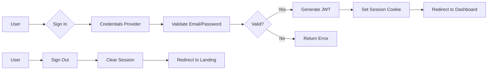
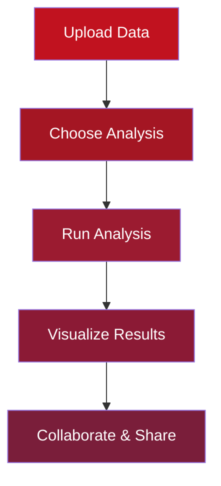

<p align="center">
  
  
  
  
</p>

<br />

<div align="center">

# 🧬 BioAlign

### *Next-Gen Bioinformatics Platform — One Platform. Every Tool.*

**The most comprehensive, production-ready bioinformatics platform built with modern web technologies. Analyze sequences, proteins, genomes, and more — all in one unified, beautiful interface.**

[🚀 Get Started](#-quick-start) • [📖 Documentation](#-features) • [🛠️ Tech Stack](#-tech-stack) • [🤝 Contributing](#-contributing) • [📄 License](#-license)

</div>

<br />

<div align="center">
  
</div>

---

## 🌟 Overview

**BioAlign** is a cutting-edge, full-stack bioinformatics platform designed to accelerate research by providing **50+ integrated tools** for sequence analysis, protein modeling, genomics, transcriptomics, phylogenetics, CRISPR design, molecular docking, and more.

Built with **Next.js 16**, **TypeScript**, **Tailwind CSS**, and **shadcn/ui**, BioAlign delivers a premium user experience with real-time collaboration, AI-powered assistance, and publication-quality visualizations.

> 💡 **Perfect for**: Research labs, academic institutions, biotech companies, and individual scientists who need a unified platform for their bioinformatics workflows.

---

## ✨ Key Highlights

| Feature | Description |
|---------|-------------|
| 🔐 **Secure Authentication** | NextAuth.js v4 with JWT strategy, bcrypt password hashing, role-based access |
| 🧬 **50+ Bioinformatics Tools** | BLAST, Clustal Omega, Primer3, gRNA Designer, Variant Caller, and many more |
| 🎨 **Beautiful UI/UX** | Modern glassmorphism design, dark mode, responsive layout, Framer Motion animations |
| ☁️ **Cloud-Powered** | Real-time analysis processing with progress tracking |
| 🤖 **AI Assistant** | Intelligent bioinformatics copilot powered by advanced LLMs |
| 👥 **Team Collaboration** | Shared workspaces, real-time editing, project management |
| 📊 **Rich Visualizations** | Interactive charts, 3D molecule viewers, genome browsers |
| 📱 **Fully Responsive** | Mobile-first design that works on all devices |

---

## 🎯 Features

### 🔬 Core Analysis Tools

<details>
<summary><b>🧬 Sequence Analysis</b></summary>

- **BLAST Search** — Search sequences against NCBI databases
- **GC Content Calculator** — Nucleotide composition analysis
- **Reverse Complement** — DNA sequence transformation
- **Translate Sequence** — DNA/RNA to protein translation
- **ORF Finder** — Open reading frame detection
- **Motif Search** — Pattern and regex-based searching
- **Restriction Mapper** — Enzyme cut site identification

</details>

<details>
<summary><b>🔗 Sequence Alignment</b></summary>

- **Pairwise Alignment** — Needleman-Wunsch & Smith-Waterman algorithms
- **Multiple Sequence Alignment** — MUSCLE & MAFFT integration
- **Clustal Omega** — Fast alignment with guide trees

</details>

<details>
<summary><b>🔮 Structure Prediction</b></summary>

- **Secondary Structure Prediction** — Alpha-helix & beta-sheet detection
- **Transmembrane Prediction** — TMHMM helix prediction

</details>

<details>
<summary><b>🧫 Genomics & Transcriptomics</b></summary>

- **Variant Caller** — SNP & indel detection (GATK pipeline)
- **Genome Annotation** — Functional annotation workflows
- **Differential Expression** — DESeq2 & edgeR analysis
- **Pathway Analysis** — GO & KEGG enrichment

</details>

<details>
<summary><b>✂️ CRISPR & Primer Tools</b></summary>

- **gRNA Designer** — Guide RNA design for CRISPR/Cas9
- **Off-Target Predictor** — Specificity scoring
- **Primer Design (Primer3)** — PCR primer optimization
- **Primer Validator** — Dimer checking & Tm calculation

</details>

<details>
<summary><b>🌳 Phylogenetics & Docking</b></summary>

- **Phylogenetic Tree Builder** — NJ & ML algorithms
- **Molecular Docking** — AutoDock integration
- **Bootstrap Support Analysis** — Statistical validation

</details>

---

### 🎨 User Interface

<div align="center">
  <table>
    <tr>
      <td width="50%" align="center"><b>Landing Page</b></td>
      <td width="50%" align="center"><b>Dashboard</b></td>
    </tr>
    <tr>
      <td>
        
      </td>
      <td>
        
      </td>
    </tr>
    <tr>
      <td width="50%" align="center"><b>Analysis Tools</b></td>
      <td width="50%" align="center"><b>Results Visualization</b></td>
    </tr>
    <tr>
      <td>
        
      </td>
      <td>
        
      </td>
    </tr>
  </table>
</div>

---

## 🛠️ Tech Stack

<div align="center">

| Category | Technology |
|----------|------------|
| **Framework** |  |
| **Language** |  |
| **Styling** |  |
| **UI Components** |  |
| **Database** |  |
| **Authentication** |  |
| **State Management** |  |
| **Animations** |  |
| **Charts** |  |
| **Forms** |  |
| **Validation** |  |
| **Icons** |  |

</div>

---

## 🚀 Quick Start

### Prerequisites

- **Node.js** >= 18.x or **Bun** >= 1.x
- **npm**, **yarn**, or **bun** package manager

### Installation

```bash
# Clone the repository
git clone https://github.com/yourusername/bioalign.git
cd bioalign

# Install dependencies
bun install

# Set up environment variables
cp .env.example .env.local
```

### Environment Configuration

Create `.env.local` file:

```env
# Database
DATABASE_URL="file:./dev.db"

# NextAuth Configuration (optional for local development)
NEXTAUTH_SECRET="your-super-secret-key-here"
NEXTAUTH_URL="http://localhost:3000"

# Optional: OAuth Providers
GOOGLE_CLIENT_ID=""
GOOGLE_CLIENT_SECRET=""
GITHUB_ID=""
GITHUB_SECRET=""
```

### Database Setup

```bash
# Push schema to database
bun run db:push

# Seed demo user (optional)
curl -X POST http://localhost:3000/api/auth/seed
```

> **Demo Credentials**: `demo@bioalign.io` / `demo1234`

### Development Server

```bash
# Start development server
bun run dev

# Open http://localhost:3000
```

```bash
# Run linting
bun run lint

# Build for production
bun run build
```

---

## 📁 Project Structure

```
bioalign/
├── prisma/
│   └── schema.prisma          # Database schema (User, Account, Post)
├── public/
│   └── ...                    # Static assets
├── src/
│   ├── app/
│   │   ├── api/
│   │   │   ├── auth/
│   │   │   │   ├── [...nextauth]/route.ts  # NextAuth API
│   │   │   │   ├── register/route.ts       # User registration
│   │   │   │   └── seed/route.ts           # Demo seeder
│   │   │   ├── analyze/sequence/route.ts   # Sequence analysis
│   │   │   └── ai/chat/route.ts            # AI chat endpoint
│   │   ├── layout.tsx           # Root layout
│   │   └── page.tsx             # Main page (Landing + Dashboard)
│   ├── components/
│   │   ├── landing/             # Landing page sections
│   │   │   ├── hero.tsx         # Hero section with DNA animation
│   │   │   ├── features.tsx     # Feature showcase
│   │   │   ├── workflow.tsx     # Workflow steps
│   │   │   ├── tools-showcase.tsx
│   │   │   └── ...
│   │   ├── dashboard/           # Dashboard components
│   │   │   ├── dashboard-layout.tsx
│   │   │   ├── sidebar.tsx
│   │   │   ├── tools-catalog.tsx
│   │   │   ├── settings.tsx
│   │   │   └── ...
│   │   ├── auth/                # Auth components
│   │   │   ├── session-provider.tsx
│   │   │   └── sign-in-modal.tsx
│   │   ├── tools/               # Analysis tool components
│   │   │   └── sequence-analysis.tsx
│   │   └── ui/                  # shadcn/ui components (40+)
│   ├── hooks/                   # Custom React hooks
│   ├── lib/
│   │   ├── auth.ts              # NextAuth configuration
│   │   ├── db.ts                # Prisma client
│   │   ├── utils.ts             # Utility functions
│   │   ├── sequence-utils.ts    # Bioinformatics utilities
│   │   └── tools-data.ts        # Tools catalog data
│   └── types/                   # TypeScript definitions
├── mini-services/               # Microservices (WebSocket, etc.)
├── examples/                    # Example implementations
├── tailwind.config.ts
├── next.config.ts
├── package.json
└── tsconfig.json
```

---

## 🔐 Authentication System

BioAlign implements a secure, production-ready authentication system:



### Security Features

- ✅ **Password Hashing** — bcryptjs with salt rounds
- ✅ **JWT Strategy** — Stateless session tokens
- ✅ **CSRF Protection** — Built-in NextAuth protection
- ✅ **Session Management** — Secure HTTP-only cookies
- ✅ **Role-Based Access** — User/admin role system

---

## 🔄 Research Workflow



### Step Details

| Step | Description | Supported Formats |
|------|-------------|-------------------|
| **1. Upload Data** | Drag & drop files with auto-format detection | FASTA, FASTQ, VCF, BAM, GenBank |
| **2. Choose Analysis** | Browse 50+ tools or get AI recommendations | All major bioinformatics formats |
| **3. Run Analysis** | Cloud-powered execution with progress tracking | Real-time status updates |
| **4. Visualize Results** | Interactive charts, 3D viewers, reports | PNG, SVG, PDF, CSV exports |
| **5. Collaborate** | Team workspaces, shareable links | Publication-ready outputs |

---

## 📊 Tool Categories

| Category | Tools Count | Status |
|----------|-------------|--------|
| 🧬 Sequence Analysis | 15 | ✅ Stable |
| 🔗 Sequence Alignment | 8 | ✅ Stable |
| 🔮 Structure Prediction | 10 | ✅ Stable |
| 🧫 Genomics | 12 | ✅ Stable |
| 🧪 Transcriptomics | 9 | ✅ Stable |
| 🌳 Phylogenetics | 7 | ✅ Stable |
| ⚗️ Molecular Docking | 6 | ✅ Stable |
| ✂️ CRISPR Tools | 5 | ✅ Stable |
| 🔬 Primer Design | 8 | ✅ Stable |
| 🛠️ Utilities | 14 | ✅ Stable |

---

## 🎨 Design System

BioAlign uses a carefully crafted design system:

### Color Palette

| Color | Hex | Usage |
|-------|-----|-------|
| Primary Red | `#C1121F` | Brand color, CTAs, accents |
| Dark Red | `#9B1B30` | Gradients, hover states |
| Accent Red | `#A41623` | Secondary elements |
| Background | `#FAFAFA` | Light mode background |
| Dark BG | `#0A0A0A` | Dark mode background |

### UI Components

- **40+ shadcn/ui components** pre-configured
- **Glassmorphism effects** with backdrop blur
- **Smooth animations** via Framer Motion
- **Dark/Light theme** support with next-themes
- **Responsive design** mobile-first approach

---

## 🤝 Contributing

We welcome contributions! Here's how you can help:

### How to Contribute

1. **Fork** the repository
2. Create your feature branch (`git checkout -b feature/amazing-feature`)
3. Commit your changes (`git commit -m 'Add amazing feature'`)
4. Push to the branch (`git push origin feature/amazing-feature`)
5. Open a **Pull Request**

### Development Guidelines

- Follow TypeScript strict mode
- Use existing shadcn/ui components
- Write meaningful commit messages
- Test thoroughly before submitting
- Keep accessibility in mind (ARIA labels, keyboard nav)

### Code Style

```typescript
// ✅ Good: Proper typing and component structure
interface SequenceAnalyzerProps {
  sequence: string;
  onResult: (data: AnalysisData) => void;
}

export function SequenceAnalyzer({ sequence, onResult }: SequenceAnalyzerProps) {
  // Component implementation
}
```

---

## 📈 Roadmap

- [ ] **v1.0** — Core platform release
- [ ] **v1.1** — Enhanced visualization suite
- [ ] **v1.2** — Team collaboration features
- [ ] **v1.3** — Plugin system for custom tools
- [ ] **v2.0** — Cloud-native distributed computing
- [ ] **v2.1** — Mobile apps (iOS/Android)

See [open issues](../../issues) for current priorities.

---

## 🙏 Acknowledgments

- **NCBI** — For BLAST and biological databases
- **Primer3** — For primer design algorithms
- **Open Source Community** — For amazing tools and libraries

---

## 📄 License

This project is licensed under the MIT License — see the [LICENSE](LICENSE) file for details.

```
MIT License

Copyright (c) 2024 BioAlign

Permission is hereby granted, free of charge, to any person obtaining a copy
of this software and associated documentation files (the "Software"), to deal
in the Software without restriction, including without limitation the rights
to use, copy, modify, merge, publish, distribute, sublicense, and/or sell
copies of the Software, and to permit persons to whom the Software is
furnished to do so, subject to the following conditions:

The above copyright notice and this permission notice shall be included in all
copies or substantial portions of the Software.
```

---

<div align="center">

### ⭐ Star This Project!

If you find BioAlign useful, please consider giving it a star on GitHub!

Made with ❤️ by the BioAlign Team

[🔝 Back to Top](#-bioalign)

</div>

<p align="center">
  <sub>Built with cutting-edge technologies. Optimized for researchers worldwide.</sub>
</p>
